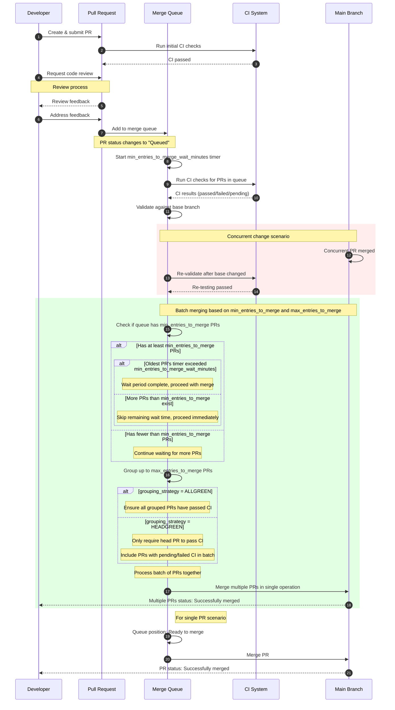

```mermaid
sequenceDiagram
    autonumber
    participant Dev as Developer
    participant PR as Pull Request
    participant MQ as Merge Queue
    participant CI as CI System
    participant Main as Main Branch
    
    Dev->>PR: Create & submit PR
    PR->>CI: Run initial CI checks
    CI-->>PR: CI passed
    Dev->>PR: Request code review
    Note over Dev, PR: Review process
    PR-->>Dev: Review feedback
    Dev->>PR: Address feedback
    PR->>MQ: Add to merge queue
    Note over PR, MQ: PR status changes to "Queued"
    MQ->>MQ: Start min_entries_to_merge_wait_minutes timer
    
    MQ->>CI: Run CI checks for PRs in queue
    CI-->>MQ: CI results (passed/failed/pending)
    MQ->>MQ: Validate against base branch

    rect rgba(255, 220, 220, 0.5)
        Note over Main, MQ: Concurrent change scenario
        Main->>Main: Concurrent PR merged
        MQ->>CI: Re-validate after base changed
        CI-->>MQ: Re-testing passed
    end
    
    rect rgba(200, 255, 200, 0.5)
        Note over MQ, Main: Batch merging based on min_entries_to_merge and max_entries_to_merge
        MQ->>MQ: Check if queue has min_entries_to_merge PRs
        
        alt Has at least min_entries_to_merge PRs
            alt Oldest PR's timer exceeded min_entries_to_merge_wait_minutes
                Note over MQ: Wait period complete, proceed with merge
            else More PRs than min_entries_to_merge exist
                Note over MQ: Skip remaining wait time, proceed immediately
            end
        else Has fewer than min_entries_to_merge PRs
            Note over MQ: Continue waiting for more PRs
        end
        
        MQ->>MQ: Group up to max_entries_to_merge PRs
        
        alt grouping_strategy = ALLGREEN
            Note over MQ: Ensure all grouped PRs have passed CI
        else grouping_strategy = HEADGREEN
            Note over MQ: Only require head PR to pass CI
            Note over MQ: Include PRs with pending/failed CI in batch
        end
        
        Note over MQ: Process batch of PRs together
        MQ->>Main: Merge multiple PRs in single operation
        Main-->>Dev: Multiple PRs status: Successfully merged
    end
    
    Note right of MQ: For single PR scenario
    MQ->>MQ: Queue position: Ready to merge
    MQ->>Main: Merge PR
    Main-->>Dev: PR status: Successfully merged
```
