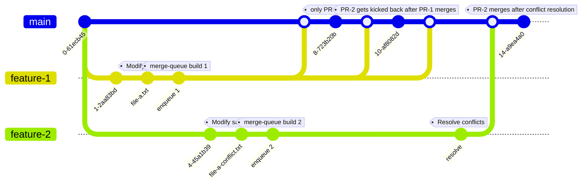

# Mid-queue Merge Conflicts

## Test

1. PR-1 gets enqueued (tests running, long enough to enqueue PR-2 while it's in the queue)
2. PR-2 gets enqueued (conflicts with PR-1)
3. Test whether:
   * PR-2 gets kicked back immediately upon enqueuing (with a reason indicating the conflict)?
   * PR-2 gets kicked back after PR-1 merges?
   * PR-2 remains in the queue but cannot be merged until the conflicts are resolved?

## Diagram

