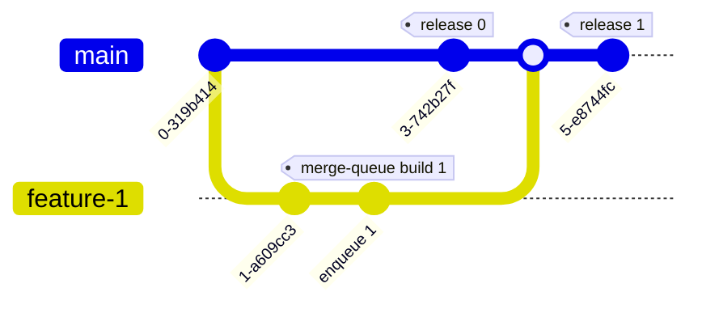

# Mutated Main

## Test

1. PR-1 gets enqueued (tests running)
2. Main gets mutated (release from prior release)
* If no merge conflict, then PR-1 just gets merged (not necessarily safe)
* If merge conflict, PR-1 gets kicked back

## Diagram

